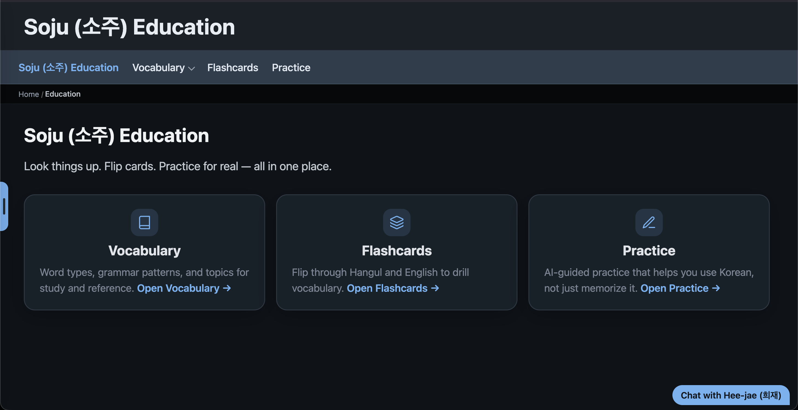

Soju (소주) Platform
====================

An **experimental** Korean language learning platform: vocabulary, grammar, and practice
in one place. This guide covers running the site, validating data, and using the Python CLIs.
There is no Python API / class reference.

Getting started
----------------

You only need `Docker Desktop <https://www.docker.com/products/docker-desktop/>`_ installed.

.. code-block:: bash

   docker compose up
   # or: uv run poe up-prod

Then open http://localhost:8080 in your browser (nginx fronts the UI and API).
For Vite on :5173 and the API on :8000, use ``uv run poe up`` — see :doc:`development/docker`.
Browsing words, grammar, and flashcards works out of the box; Practice and Chat need
a local AI model — see :doc:`development/ai` if you want those.

For a non-technical overview of features, see ``README.md`` at the repository root.

For contributors
-----------------

Setting up the Python tooling, running validation and tests, and building these docs
is covered under **Development** below. Agent-oriented rules live in ``AGENTS.md`` at
the repo root.

Documentation
-------------

.. toctree::
   :maxdepth: 1
   :caption: CLI reference

   cli/soju
   cli/import
   cli/promote
   cli/validate-schemas
   cli/align
   cli/registry
   cli/translate-words
   cli/fill-examples
   cli/fill-verbs
   cli/embed-index
   cli/backend

.. toctree::
   :maxdepth: 1
   :caption: Development

   development/site
   development/ai
   development/tts
   development/static-build
   development/validate
   development/import
   development/python
   development/docs
   development/editor
   development/agents
   development/data-layout
   development/poe
   development/docker
