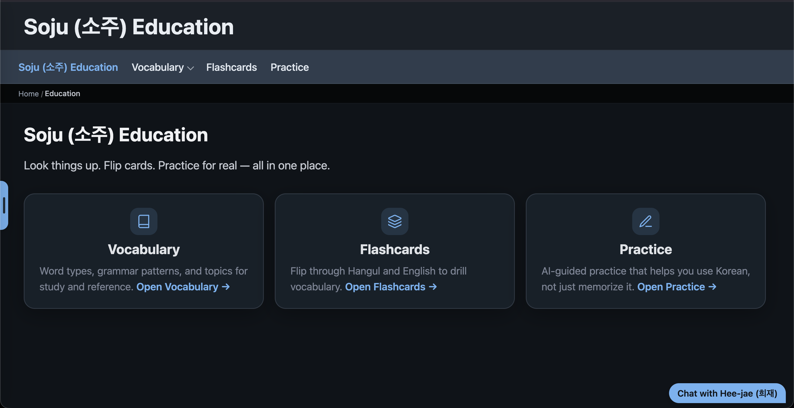

Soju (소주) Platform
====================

An **experimental** Korean language learning platform: vocabulary, grammar, and practice
in one place. This guide covers running the site, validating data, and using the Python CLIs.
There is no Python API / class reference.

Documentation
-------------

.. toctree::
   :maxdepth: 1
   :caption: Introduction

   intro/getting-started
   intro/adding-vocabulary
   intro/adding-verbs

.. toctree::
   :maxdepth: 1
   :caption: CLI reference

   cli/soju
   cli/import
   cli/promote
   cli/levels
   cli/validate-schemas
   cli/align
   cli/registry
   cli/translate-words
   cli/fill-examples
   cli/fill-verbs
   cli/embed-index
   cli/backend

.. toctree::
   :maxdepth: 1
   :caption: Development

   development/site
   development/ai
   development/tts
   development/static-build
   development/validate
   development/import
   development/python
   development/docs
   development/editor
   development/agents
   development/data-layout
   development/poe
   development/docker
   development/libraries
